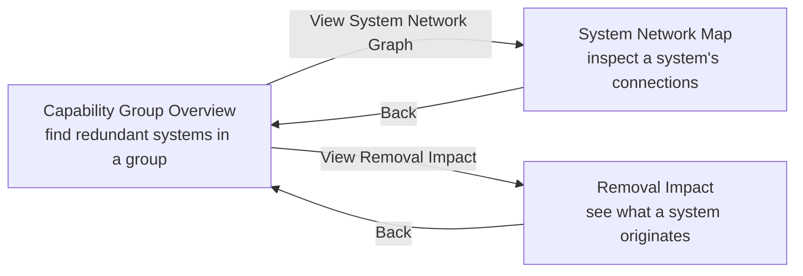

# TAP App V1 — User Guide

A guide for MHS enterprise architects and portfolio analysts working with the TAP App inside SEMOSS.

---

## 1. What TAP App V1 Helps You Answer

TAP App V1 is a read-only analytics view over the MHS systems portfolio. It is built to help you answer three recurring questions about how systems, capabilities, and data fit together:

1. **Where is functional redundancy?** Within a capability group, which systems duplicate each other's business processes, activities, and data subject areas — and which contribute something unique?
2. **How is data actually flowing?** For a given system, which other systems exchange data with it, through which interfaces, in which direction, and for which data objects?
3. **What does this system originate or feed?** Is the system an authoritative data source? Which data objects does it create or modify, and which downstream systems does it push data to?

Each of the three pages in the app is designed to answer one of these questions. You can move between them while preserving context (for example, jumping from a capability group into a system's network and coming back to the same zoomed view).

> **The app is read-only.** Nothing you do in the UI changes the underlying portfolio data. All analyses are computed from the current snapshot of the TAP Core knowledge graph and refresh each time a page loads.

---

## 2. Getting Around the App

### Top navigation

A persistent top nav bar gives you three entry points:

| Nav link | Page |
|---|---|
| **Capability Group Overview** | Bubble chart of capability groups and their member systems, with per-group overlap analysis. |
| **System Network Map** | Searchable directory of systems and a force-directed network graph of any selected system's data exchanges. |
| **Removal Impact** | Data Flow Impact Analyzer: a system-by-system view of authoritative data status, data objects created or modified, and outbound connections. |

The active page is highlighted in the nav bar. You can switch pages at any time.

### Cross-page flow

The pages are designed to be used together. The most common flow is:

When you launch a sub-page from the capability group sidebar, the destination page auto-selects the system you clicked. Pressing **Back** returns to the bubble chart with the original capability group still zoomed in, so you don't lose your place.

### Browser back / forward and refresh

The app uses hash-style URLs (the page route appears after a `#` in the address bar). Browser back and forward work normally for moving between pages. A refresh reloads the current page from scratch — any selections, zoom, expanded panels, or sidebar state will reset (the in-app **Back** button is what preserves context).

### Loading behavior

Most pages fetch their data once when they open. While that happens you'll see a spinner. The bubble chart, the network graph, and the system list all become interactive as soon as the underlying data is ready.

---

## 3. Capability Group Overview

**Use this page to find which systems within a capability group overlap most with their peers — and which add something unique.**

### Layout

- A **bubble chart** fills the canvas. Each large circle is a capability group (or a capability, depending on the toggle), and the smaller circles packed inside it are the systems mapped to that group.
- A **view-mode toggle** at the top-right of the page header switches between **Capability Groups** and **Capabilities** as the grouping. The header sentence updates to match.
- A **right-hand sidebar** slides in when you zoom into a group.
- A **System Inspection Panel** opens on the right when you click an individual system bubble.

### Navigating the bubble chart

| Action | Result |
|---|---|
| Click a group bubble | Zooms into that group; opens the **Capability Group Sidebar** on the right. |
| Click the background while zoomed in | Zooms back out and closes the sidebar. |
| Click a system bubble | Opens the **System Inspection Panel** for that system. |
| Hover a system bubble | Shows a tooltip with the system name. |
| Resize the window | The chart re-fits to the available space. The currently zoomed group is preserved. |

### Reading the Capability Group Sidebar

When you zoom into a group, the sidebar shows:

- **A stats bar** with totals for the whole group: Systems, BPs (business processes), Activities, and Data Subject Areas.
- **A description** of the capability group.
- **A ranked list of systems** ordered by **Mean Pairwise Similarity Score**, highest first. Each row shows the system's rank, name, score (0–100), and a `(N/M pairs)` completeness annotation when not every peer comparison returned a score.
- **A pairwise comparison panel** under each system row, where you can pick any peer in the group and see how the two systems compare across six independent similarity buckets.
- **Action buttons** on each row for jumping to the System Network Map or Removal Impact for that system.

#### What "Mean Pairwise Similarity Score" means

For every pair of systems in the capability group, the backend computes a per-pair **summary score** on a 0–100 scale. A system's row in the sidebar shows the **average summary score across all pairs that system participates in** within the group. Higher means more similar to the rest of the group; lower means more differentiated.

The `(N/M pairs)` annotation tells you how complete the average is. `M` is the total number of peer pairs (one less than the number of systems in the group); `N` is how many of those pairs the backend was able to return a summary score for. When `N` is less than `M`, the score is computed from the available pairs only.

The sidebar header reads, verbatim:

> *This list ranks each system in the capability group by **Mean Pairwise Similarity Score**, the average of all available backend similarity summary scores against other systems in the group.*

If the similarity service is unavailable, the rows still render but each pairwise card reads "Similarity score not available."

#### The six similarity buckets

Each per-pair summary score is the mean of up to six bucket scores. A pair gets a score in a bucket only when both systems have data for that bucket; otherwise that bucket reads "Not available" and the summary is computed from the remaining buckets.

| Bucket (as labeled in UI) | Compares |
|---|---|
| **Business Processes** | The set of business processes each system supports |
| **Activities** | The set of activities each system supports |
| **Data Subject Areas** | The data subject areas each system covers |
| **Environment** | The deployment environment (Theater / Garrison / Both) |
| **User Types** | Personnel / user-type assignments |
| **Interfaces** | The system interfaces each system provides or consumes |

#### Pairwise comparison cards

Under each system row is a horizontally scrollable strip of peer cards titled **Similarity to systems in group**. Each card shows a peer's name and the pair's summary score (or "Not available"). The cards are sorted by summary score, highest first.

Click any peer card to select it. A **Similarity breakdown** panel opens directly below, showing:

- The **Summary Score** for that specific pair, highlighted in blue. If the pair has bucket data but no computable summary, it reads: *"Summary score cannot be computed due to incomplete data."*
- A per-bucket readout for all six buckets, each showing a 0–100 score or "Not available".

The first peer card is selected by default, so you always see a breakdown without having to click. Selection is remembered per system row while the sidebar is open.

#### Jumping to other pages from the sidebar

Every system row has two action buttons:

- **View System Network Graph** — opens the **System Network Map** with this system pre-selected. Pressing **Back** there returns to this page with the group still zoomed in.
- **View Removal Impact** — opens the **Removal Impact** page with this system pre-selected. Pressing **Back** there also returns to the same zoomed group.

### Reading the System Inspection Panel

When you click a system bubble (in any group), a panel slides in on the right showing every known attribute of that system.

The panel header shows three metadata fields when available: **Description**, **Disposition**, and **Owner**. If a field has no value, it reads "Not available".

Below that are seven tabs. Each tab label shows a count where relevant:

| Tab | What it shows |
|---|---|
| **Data Subject Areas** | The data subject areas this system is associated with. |
| **Interfaces** | The interfaces this system exposes or consumes. |
| **Business Processes** | The business processes the system supports. Click an item to find other systems that support the same process. |
| **Activities** | The activities the system supports. Click an item to find other systems that support the same activity. |
| **User Types** | Personnel or user-type assignments for this system. |
| **Environment** | The deployment environment for this system (single value). |
| **Transactional** | Whether the system is transactional (single value). |

On the **Business Processes** and **Activities** tabs, clicking a row triggers a lookup of other systems that share that concept and lists them inline. Click the same row again to collapse the lookup.

---

## 4. System Network Map

**Use this page to see how a system is connected to the rest of the portfolio through its data-carrying interfaces.**

The page has two modes that share a single data load: a **list view** (the default) and a **graph view** (entered by clicking a system).

### List view

A searchable, scrollable directory of every system in the portfolio. Systems are sorted by **connection count** — the system with the most direct neighbors appears first.

- Type in the search box to filter the list by system name.
- Click any row to enter the graph view focused on that system.

### Graph view

Once you select a system, you're taken to a force-directed network graph centered on it.

#### Three panels

- **Left sidebar** — controls for the graph (see below).
- **Center canvas** — the network graph itself. The focal system is highlighted; its neighbors are shown as connected nodes. Nodes are draggable; edges are curved arcs with arrowheads indicating direction of data flow.
- **Right sidebar** — appears only when you click an edge; shows direction-by-direction details for that connection.

#### Left sidebar controls

- **Back to List** — returns to the searchable system list.
- **Selected System** — shows the focal system's name and the current node and edge counts in the graph.
- **Connection Depth** — controls how many hops out from the focal system to include:
  - The **Degree** label shows the current depth and the maximum reachable depth for this system (for example, "Degree 2 of 5").
  - A **slider** plus numbered **tick buttons** let you jump to any depth.
  - The **Expand to Degree N** button advances one hop at a time. When you can't go any further, it reads **Fully Expanded**.
  - Below the controls, a sentence describes what the current depth includes ("Showing all systems, interfaces, and data objects within N system-hops of <system>").
- **Canvas Controls** — **Lock** and **Unlock** the simulation:
  - **Unlock** (default): physics is active. Nodes float into a settled layout and can be dragged around.
  - **Lock**: nodes freeze in place. You can still pan and zoom the canvas, but layout won't shift. Useful for studying a settled arrangement without accidental movement.

> Changing the focal system or the degree automatically resets canvas-related state — the simulation unlocks, any selected edge is cleared, and the data-object filter (below) is reset.

#### What a "hop" means

A **system-hop** is one direct system-to-system connection. **Degree 1** means only systems that exchange data directly with the focal system. **Degree 2** means those systems plus *their* direct neighbors, and so on, until you reach the maximum depth at which the focal system has any further reachable neighbors.

Degree expansion is a pure-client recompute — no extra data is fetched when you change the slider, so it responds instantly even on large graphs.

#### Data Object filter

A **Data Object** dropdown sits at the top-left of the canvas. It lists every unique data object carried by any edge in the current graph, with a count of how many edges carry each one. You can filter the dropdown with its own search box.

- Selecting a data object **highlights** all edges that carry it in either direction, plus the systems on either end of those edges, and dims everything else.
- A **Reset Graph** action clears the filter.
- Changing depth or system clears the filter too.

#### Edge details

Click an edge between two systems and the **right sidebar** opens. It shows the connection broken out into two directions:

- **Forward direction** (`System A → System B`) — the data objects flowing in that direction, broken down by the underlying interfaces.
- **Reverse direction** (`System B → System A`) — the same, for the opposite direction.

A direction that has no flow reads "No data flow" in its bucket. Clicking the same edge again, pressing the close button, changing depth, or selecting a data-object filter all dismiss the sidebar.

### Getting to this page

You reach the System Network Map three ways:

1. From the **System Network Map** link in the top nav.
2. By clicking **View System Network Graph** on a system row inside the Capability Group sidebar.
3. By clicking the equivalent action from the Removal Impact context (where surfaced).

When you arrive via a cross-page link, the page enters graph view immediately on the pre-selected system, and the page header shows a **Back** button that returns to the originating page with its previous state restored.

---

## 5. Removal Impact (Data Flow Impact Analyzer)

**Use this page to see what a single system contributes to the data fabric: whether it's an authoritative data source, which data objects it creates or modifies, which other systems it sends data to, and which other systems send data to it.**

The page title in the header reads **Data Flow Impact Analyzer**; the nav link reads **Removal Impact** — they refer to the same page.

> **What this page is and is not.** It summarizes the selected system's current role as a data originator, outbound publisher, and inbound consumer. It is not a what-if simulation — it reports what the current data model says about the system, not the predicted state of the portfolio if the system were turned off.

### System selection view

When you open the page you see a searchable directory of every **active** system. The page subtitle reads, verbatim:

> *Select a system to view its authoritative data status, data objects created or modified, outbound connections, and inbound connections.*

Use the search box to filter by name; systems are listed alphabetically. Click a card to analyze that system.

### Analysis view

After you select a system, the header shows the system name, the subtitle **System connection analysis**, and a **Back** button. The body is divided into four sections, in this order.

#### 1. Authoritative Data Source

A single status indicator at the top:

- **Authoritative Data Source** (green badge) — this system is recognized as an authoritative data source. The associated **Data Subject Areas** for which it is authoritative are listed below the badge.
- **Not an Authoritative Data Source** (gray badge) — this system is not designated as authoritative for any data subject area.

#### 2. Data Objects Created or Modified

A list of every data object this system originates, with a per-row badge that indicates the system's role:

- **Creator** — this system creates the data object.
- **Modifier** — this system modifies the data object (but is not the creator).

If the system neither creates nor modifies any data object, the section reads: *"This system does not create or modify any data objects."*

#### 3. Outbound Data Connections

A list of every other system this system pushes data to via an interface. Each entry shows the target system name (prefixed with `→`) and the set of data objects carried on that outbound link. If the system has no outbound interfaces, the section reads: *"No outbound interfaces found for this system."*

#### 4. Inbound Data Connections

A list of every other system that sends data into this system through a supported interface. Each entry shows the source system name (prefixed with `←`) and the set of data objects carried on that inbound link. If no other system sends data to this one, the section reads: *"No inbound interfaces found for this system."*

Together, sections 3 and 4 give you a complete first-order picture of which systems exchange data with the selected system, and in which direction.

### Getting to this page

You reach Removal Impact two ways:

1. From the **Removal Impact** link in the top nav.
2. By clicking **View Removal Impact** on a system row inside the Capability Group sidebar — the page opens directly into the analysis view for that system. Pressing **Back** returns to the bubble chart with the original capability group still zoomed in.

---

## 6. Glossary

Terms used throughout the app, in the language they appear in.

| Term | Meaning |
|---|---|
| **Capability Group** | A grouping of related capabilities. In the Overview, each capability group is one large bubble. |
| **Capability** | A finer-grained grouping inside the same view, available via the view-mode toggle on the Capability Group Overview. |
| **Business Process (BP)** | A business process the system supports. Shown with a colored kind badge in sidebars and inspection lists. |
| **Activity** | A discrete activity the system supports. Shown with a colored kind badge. |
| **Data Subject Area** | A subject-area grouping of data. Shown with a colored kind badge. Appears as the first tab of the System Inspection Panel and as an Authoritative-Data-Source attribute on the Removal Impact page. |
| **Data Object** | A specific data item that flows over a system interface. Used in the System Network Map (filter and edge details) and in the Removal Impact "Created or Modified" and "Outbound Connections" sections. |
| **Interface** | A defined connection over which one system sends data to another. Listed on the System Inspection Panel's Interfaces tab and used as the structural basis for edges in the network map. |
| **Mean Pairwise Similarity Score** | The average of all available backend pairwise similarity summary scores for a system against the other systems in its capability group. Range 0–100, where higher = more similar to peers. Primary ranking metric in the Capability Group Sidebar. |
| **Similarity Bucket** | One of the six dimensions compared between two systems: Business Processes, Activities, Data Subject Areas, Environment, User Types, Interfaces. Each contributes a 0–100 score; the pair summary score is the mean of the buckets the pair has scores for. |
| **Pairwise Summary Score** | The per-pair similarity between two systems, computed as the mean of the available bucket scores for that pair. Range 0–100. |
| **Pairwise Comparison Card** | The per-peer card under each system row in the Capability Group Sidebar that shows the pair's summary score and the six-bucket breakdown for that specific pair. |
| **(N/M pairs) annotation** | Completeness indicator on a system's similarity score. `M` is the number of peer systems in the group; `N` is how many of those peers returned a usable pairwise summary score. |
| **Connection count** | The number of systems a given system exchanges data with directly. Used to sort the System Network Map's list view. |
| **Connection Depth / Degree** | How many system-hops outward from the focal system are included in the graph. Degree 1 is direct neighbors only; higher degrees expand outward. |
| **System-hop** | One direct system-to-system connection. |
| **Lock / Unlock** | Whether the network graph's physics simulation is frozen. Locked = nodes stay put; Unlocked = nodes settle and can be dragged. |
| **Forward direction / Reverse direction** | The two directions of data flow on a system-to-system connection in the network map's edge detail panel. |
| **Active System** | A system that is currently in service. The Removal Impact directory lists only active systems. |
| **Authoritative Data Source (ADS)** | A system designated as authoritative for one or more data subject areas. Shown as a green badge on the Removal Impact page. |
| **Creator / Modifier** | The system's role for a given data object on the Removal Impact page. *Creator* means the system originates the data object; *Modifier* means the system modifies it. |
| **Outbound Data Connection** | A connection from the selected system to another system, with one or more data objects flowing along it. Listed in section 3 of the Removal Impact analysis view. |
| **Inbound Data Connection** | A first-order data exchange where another active system sends data to the selected system through a supported interface. Listed in section 4 of the Removal Impact analysis view. |
| **Description / Disposition / Owner** | Metadata fields shown at the top of the System Inspection Panel. May read "Not available" if not populated. |

---

*This guide is intended for analysts using the app inside SEMOSS. For information about extending the app or running it locally, see the separate Developer Guide.*
